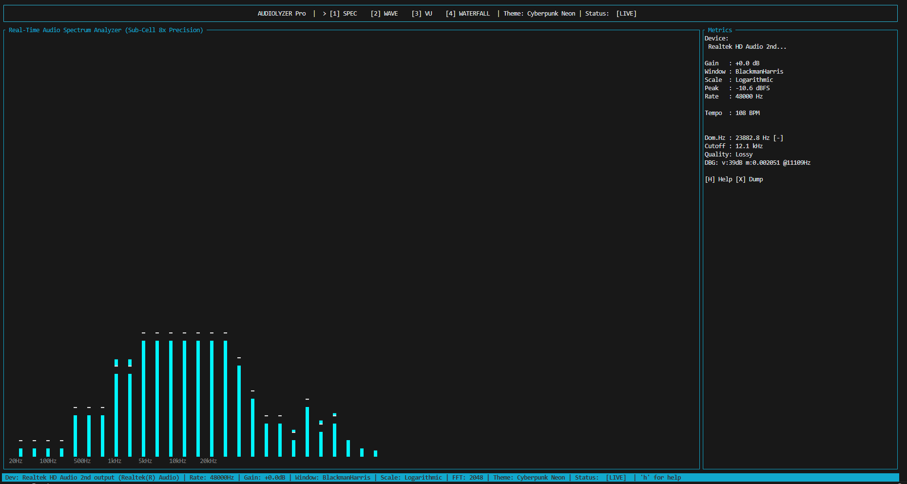
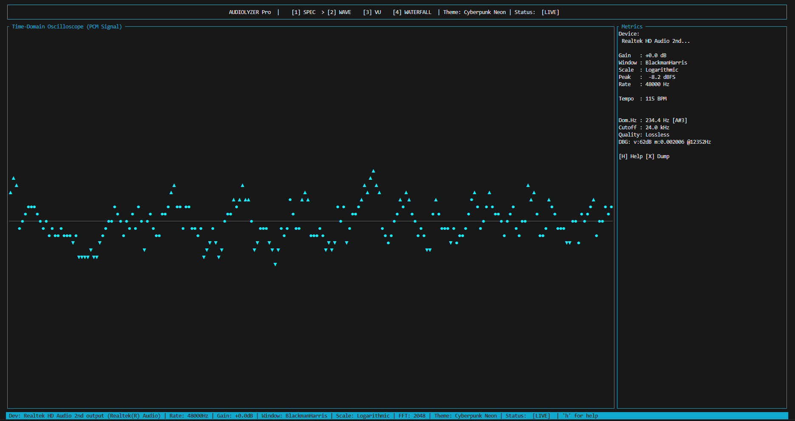
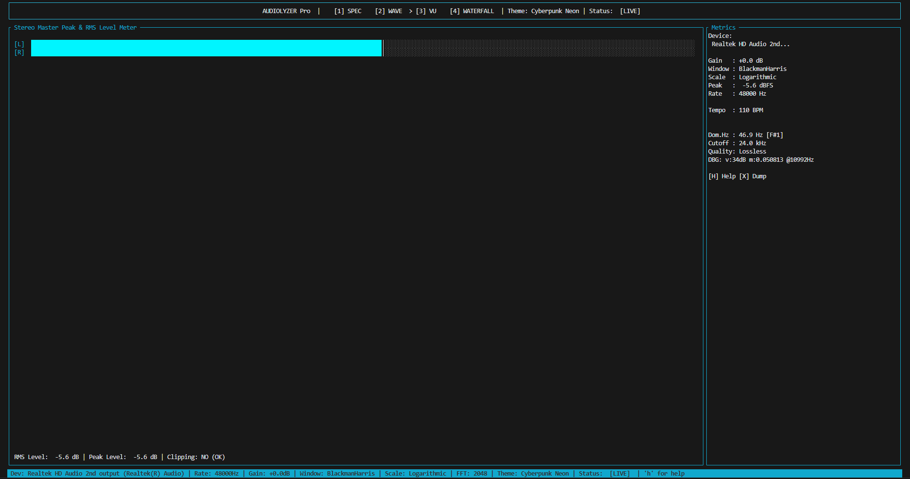
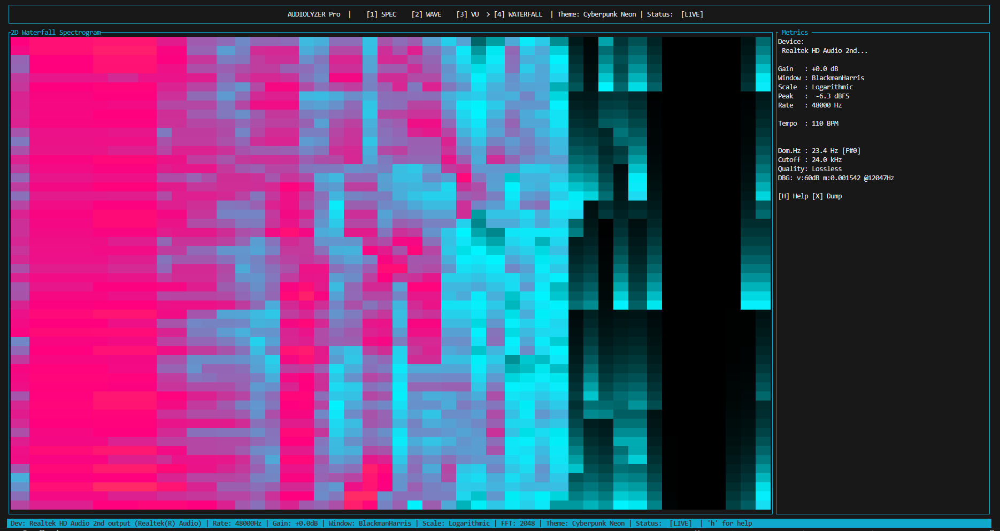

# Audiolyzer Pro: Real-Time Audio Spectrum Analyzer & Oscilloscope

[](https://www.rust-lang.org/)
[](LICENSE)
[]()

Audiolyzer Pro is a high-performance, low-latency audio visualization engine and interactive terminal application implemented in Rust. Designed for systems programmers, audio engineers, and power users, it captures live system output audio in real-time, performs Discrete Fourier Transforms (DFT), and renders frequency spectrums, oscilloscopes, and VU meters inside the terminal at a constant 60 Frames Per Second (FPS).



---

## Technical Highlights & Architecture

The application is engineered around strict memory safety, real-time performance, and zero heap allocations within the execution hot loop.

```
+------------------+         Lock-Free RingBuffer        +------------------------+
|  CPAL Audio Host |  ---------------------------------> |   Audio SPSC Buffer    |
| (WASAPI Loopback)|   (Producer Thread: Float32 PCM)    +------------------------+
+------------------+                                                 |
                                                                     v
+------------------+         Sub-Cell Renderer           +------------------------+
| Crossterm / TUI  | <---------------------------------- |   DSP Processing Pipe  |
|  Terminal Screen |      (Render Loop: 60 FPS)          | (Hann -> FFT -> Bins)  |
+------------------+                                     +------------------------+
```

### Core Architecture Principles

1. **Lock-Free Multithreaded Decoupling**: Audio capture runs on a dedicated high-priority OS callback thread. Real-time audio samples are pushed into a Single-Producer Single-Consumer (SPSC) ring buffer, completely isolating audio capture latency from the TUI rendering engine.
2. **Zero-Allocation Hot Loop**: All processing buffers (time-domain samples, complex FFT structures, logarithmic bin arrays, and ballistic decay states) are pre-allocated during initial startup. No dynamic memory allocation (`malloc`/`realloc`) occurs during active processing loops.
3. **Sub-Cell Vertical Resolution**: Utilizes block Unicode characters (` ▂▃▄▅▆▇█`) to achieve an 8x vertical rendering resolution beyond standard character grid limits.

---

## Digital Signal Processing (DSP) Pipeline

### 1. Windowing Function (Spectral Leakage Suppression)
To reduce spectral leakage caused by finite-length time domain truncations, raw PCM samples $x[n]$ are multiplied by a windowing function prior to FFT conversion. The default window is the Hann Window:

$$w[n] = 0.5 \left( 1 - \cos\left(\frac{2\pi n}{N-1}\right) \right), \quad 0 \le n < N$$

Supported selectable window functions include Hann, Hamming, and Rectangular (no window).

### 2. Fast Fourier Transform (FFT) & Dynamic Resolution
The windowed discrete-time sequence is transformed into the frequency domain using the Cooley-Tukey FFT algorithm:

$$X[k] = \sum_{n=0}^{N-1} x[n] w[n] \, e^{-i \frac{2\pi}{N} k n}, \quad 0 \le k < N$$

The application supports **Dynamic FFT Size Selection** ($N \in \{512, 1024, 2048, 4096, 8192\}$). This allows live toggling between high time-resolution (small $N$) and high frequency-resolution (large $N$, where $\Delta f = \frac{f_s}{N} \approx 5.8 \text{ Hz}$ at $N=8192$).

### 3. Logarithmic Frequency Binning & dBFS Scale Conversion
Human perception of sound frequency is logarithmic. Linear FFT frequency bins are mapped into $K = 48$ logarithmic frequency bands spanning from $20\text{ Hz}$ to $20\text{ kHz}$:

$$f_k = f_{\text{min}} \cdot \left( \frac{f_{\text{max}}}{f_{\text{min}}} \right)^{\frac{k}{K}}$$

Magnitudes $|X[k]|$ are normalized and converted to Decibels relative to Full Scale (dBFS):

$$\text{dBFS} = 20 \cdot \log_{10} \left( \frac{|X[k]|}{N} + \epsilon \right) + G$$

Where $G$ represents user-configured gain offset (dB). The resulting values are normalized within $[-60\text{ dBFS}, 0\text{ dBFS}]$ and clamped to $[0.0, 1.0]$.

### 4. Real-Time Beat Detection & Tempo (BPM) Analysis
The DSP engine features a real-time Beat & BPM Detector that monitors energy accumulation in the sub-bass frequency region ($20\text{ Hz} - 100\text{ Hz}$):

$$E_{\text{bass}} = \frac{1}{M} \sum_{k=0}^{M-1} |X[k]|$$

A beat event is registered when the instantaneous energy exceeds the rolling average energy by a specified ratio ($E_{\text{bass}} > 1.5 \cdot \bar{E}_{\text{history}}$) with a 200ms debounce filter. Inter-beat intervals $\Delta t$ are computed to estimate live tempo ($\text{BPM} = \frac{60}{\Delta t}$).

### 5. Dynamic Ballistics (Smoothing and Peak Falloff)
Bar levels are smoothed using an exponential decay envelope, while peak indicators drop at a linear rate:

$$y_{\text{bar}}[t] = \max(y_{\text{target}}, \, y_{\text{bar}}[t-1] \cdot \alpha_{\text{decay}})$$

$$y_{\text{peak}}[t] = \max(y_{\text{bar}}[t], \, y_{\text{peak}}[t-1] - \beta_{\text{falloff}})$$

### 6. Peak Frequency & Musical Note (Pitch) Detection
The DSP engine evaluates raw FFT bin magnitudes to locate the dominant peak frequency $f_{\text{peak}}$:

$$f_{\text{peak}} = \arg\max_{k} |X[k]| \cdot \frac{f_s}{N}$$

It automatically translates $f_{\text{peak}}$ into its corresponding musical pitch notation (e.g., A4, C#5) using logarithmic MIDI note mapping:

$$\text{MIDI Note} = \left\lfloor 12 \cdot \log_2\left(\frac{f_{\text{peak}}}{440}\right) + 69.5 \right\rfloor$$

### 7. Audio Quality Estimator (Valley Detection)
To detect lossy compression (MP3/AAC brickwall filters) vs lossless audio sources (FLAC/WAV/AIFF) in real-time, the engine uses **Valley Detection with Absolute Magnitude Verification**:
- **Sliding Band Analysis**: Evaluates 500Hz sliding bands between 8 kHz and 22 kHz to detect "valleys" of silence.
- **Dual-Criteria Verification**: Classifies audio as **Lossy** if a frequency valley drops $>50\text{ dB}$ below low-mid music energy *AND* has an absolute magnitude $< 0.001$ (eliminating false positives caused by natural high-frequency roll-off in lossless tracks).

---

## Technology Stack & Technology Citations

This application builds upon industry-standard Rust libraries:

- **[`cpal`](https://crates.io/crates/cpal)**: Cross-Platform Audio Library. Provides low-level audio device enumeration and host stream management. Configured for WASAPI Loopback capture on Windows to record desktop system output audio natively.
- **[`rustfft`](https://crates.io/crates/rustfft)**: High-performance, SIMD-accelerated Fast Fourier Transform library written in pure Rust.
- **[`ringbuf`](https://crates.io/crates/ringbuf)**: Lock-free Single-Producer Single-Consumer (SPSC) queue providing thread-safe buffer sharing without mutex contention.
- **[`ratatui`](https://crates.io/crates/ratatui)**: Modern Rust terminal user interface framework for building rich layout blocks and widgets.
- **[`crossterm`](https://crates.io/crates/crossterm)**: Cross-platform terminal manipulation library handling raw mode execution, terminal resizing, and non-blocking input events.
- **[`anyhow`](https://crates.io/crates/anyhow)**: Flexible error handling abstraction for contextual error reporting.

---

## Visualization Modes & Features

### 1. Spectrum Analyzer (Mode `1`)
Displays 48 ISO logarithmic frequency bands with sub-cell precision (8x vertical resolution), peak cap indicators, and real-time side metrics dashboard.


### 2. Time-Domain Oscilloscope (Mode `2`)
Visualizes continuous raw Float32 PCM audio waveforms centered on a zero-crossing reference line to inspect transient characteristics.



### 3. Stereo Master VU Meter (Mode `3`)
Features dual-channel (Left / Right) RMS and Peak level meters with precise dBFS scale markers and visual clipping detection indicators.



### 4. 2D Waterfall Spectrogram (Mode `4`)
A continuous temporal heatmap visualizer showing frequency spectrum evolution over time across a rolling history buffer.



### Additional Features
- **Interactive Audio Device Selector (`D`)**: Hot-swap audio input/output sources on the fly via a popup modal without restarting the application.
- **Real-Time BPM & Beat Flash**: Monitors kick drum beats and displays current estimated music tempo with visual sidebar flash indicators.
- **Dominant Pitch & Quality Estimator**: Displays real-time dominant peak frequency, musical pitch notation, estimated cutoff frequency, and Lossy/Lossless quality analysis.

---

## Keybindings and Controls

| Key / Control | Function Description |
| :--- | :--- |
| `1` | Switch view to Spectrum Analyzer Mode |
| `2` | Switch view to Time-Domain Oscilloscope Mode |
| `3` | Switch view to Stereo VU Meter Mode |
| `4` | Switch view to 2D Waterfall Spectrogram Mode |
| `[` / `]` | Decrease / Increase FFT Size (Dynamic Resolution: 512 to 8192) |
| `D` | Open interactive Audio Device Selector popup modal |
| `Tab` | Cycle color themes (Cyberpunk, Matrix, Fire, Studio Dark) |
| `W` | Toggle window function (Blackman-Harris -> Hann -> Rectangular -> Hamming) |
| `S` | Toggle frequency scale mode (Logarithmic vs Linear) |
| `X` | Dump raw FFT spectrum to `spectrum_debug.csv` for analysis |
| `Up Arrow` | Increase audio input gain sensitivity (+3.0 dB) |
| `Down Arrow` | Decrease audio input gain sensitivity (-3.0 dB) |
| `Space` | Freeze / Pause visualizer rendering |
| `H` / `?` | Toggle Help & Keybindings overlay modal |
| `Ctrl + C` / `Q` / `Esc` | Gracefully quit application and restore terminal state |

---

## Build and Installation Guide

### Prerequisites

- **Rust Toolchain**: Install via [rustup.rs](https://rustup.rs/) (edition 2021, Rust 1.70+ recommended).
- **Windows / Linux / macOS Audio Setup**: On Windows, WASAPI loopback works out of the box for default output devices.

### Compilation

```bash
# Clone the repository
git clone https://github.com/julianfiru/rust-audiolyzer.git
cd rust-audiolyzer

# Compile optimized release binary
cargo build --release

# Run application
cargo run --release
```

---

## Troubleshooting

- **No audio signal (Flat spectrum)**: Ensure system audio is actively playing. Verify that Windows Privacy settings allow desktop applications to access audio endpoints (Settings -> Privacy & Security -> Microphone -> Enable "Let desktop apps access your microphone").
- **Terminal artifacting**: Ensure your terminal emulator supports ANSI escape sequences and UTF-8 encoding (e.g., Windows Terminal, Alacritty, Kitty, WezTerm, or VS Code Terminal).

---

## License

Distributed under the MIT License. See `LICENSE` for details.
